# Ray Caster / Tracer in Swift

This repository contains the skeleton for a ray caster/tracer in Swift. You'll be using the same code base throughout the course of this class so it is important that you write clean code. We'll start off writing a ray caster that supports a perspective camera, primitives (spheres, planes, triangles), matrix transforms, phong shading, and texture mapping.

Once that is finished, we'll add some features and turn it into a ray tracer. The ray tracer will have a better shading model and recursively generate rays to support reflections and shadows. It will also support procedural texturing and supersampling.

# Overview of starter code

## Creating a RayCaster instance

The code provided in this repository handles a lot of the necessary grunt work. A `Scene` class has been provided that will load in each scene file and call each class' appropriate `init`.

A few constants are provided in `AppDelegate` that will allow you to change the scene file, width and heigh of output image, whether or not images are saved and toggle [octree](http://citeseerx.ist.psu.edu/viewdoc/summary?doi=10.1.1.29.987) (acceleration structure that we'll discuss later on) usage on/off.

`AppDelegate` will immediately create a new RayCaster, parse the first scene in `sceneFiles`, and initialize the correct objects. It then calls the `render` method on this RayCaster. Your main ray casting loop should go in `render`.

## Object types

All objects exist in a `Scene` which has its own `Camera` `Lights`, `Materials`, and `Group`. A `Group` implements the `Hitable` protocol (`intersect` method) and contains all the `ObjectTypes` (which also implement `Hitable`. The `ObjectTypes` (subclass of `Hitable` protocol that adds a `Material`) we'll support are `Plane`, `Sphere`, and `Triangle` (`Triangles` belong to a `TriangleMesh` which implements `Hitable` and passes the ray down to its children). All `Hitable` types can belong to a `Transform` which will apply matrix transforms to its child.

## Math helpers

The code makes use of [`simd` vector and matrix types](http://www.russbishop.net/swift-2-simd). I have included a `MathHelper.swift` file with some methods to make your life easier. Some of these are just aliases to `simd` functions and others implement stuff `simd` does not offer (creation of transform matrices). Two common and well named functions that `simd` provides (so are not defined in `MathHelper.swift`) are cross product (`cross(a: vector_float3, b: vector_float3)`) and dot product (`dot(a: vector_float3, b: vector_float3)`).

## Depth image, normals image, shaded image

You can switch between your depthImage, normalImage, and shaded image using the `D`, `N`, and `I` keys respectively.

The shaded image is set up to show automatically once done processing. Early on, you'll want to modify the code to show the `depthImage` instead since we won't start generating shaded images until week 3.

# Week 1

## Camera, ray cast loop, ray-plane intersections and depth images

### Set up the camera

Implement `PerspectiveCamera`'s `init` function correctly. `up` and `direction` are guaranteed to be on the same plane but are not necessarily perpendicular to each other. The direction of the `direction` vector should not change but use cross product to guarantee all 3 parts of your orthobasis are perpendicular to each other. Don't forget to normalize your basis vectors!

Once your camera is initialized, implement `generateRay` according to the lecture. Make sure that your `generateRay` uses normalized coordinates for your image plane (-1 < x < 1 and -1 < y < 1).

### Set up the ray cast loop

Now move on over to `RayCaster` and implement your ray cast loop. Loop over each pixel and generate rays to the point (you'll have to convert to the normalized coordinates that your `PerspectiveCamera` is expecting. All heavy lifting should be done in `raycastPixel` so that it'll be easier to parallelize your code later on!

For each pixel, generate a `Ray` with the `scene.camera` instance, an empty `Hit` and call `scene.group.intersect`.

### Ray-plane intersections

Now that we have our render loop set up, go implement the `intersect` method in `Plane`. This will automatically get called as the scene's root group iterates over it's primitives. See the lecture slides if you need help!

### Render depth to intersections

If there was an intersection, you'll want to save `t` to `depthImage`. `setDepthPixel` does this for you and also clips high `t` values automatically (check out `Image.setDepthPixel` and `Image.generateDepthNSImage` to see how this works.

Once your ray cast loop is down, call `processDepth`. See the hints below for more information on displaying it automatically.

### Hints

- Set `SCENES_TO_PARSE` to `SceneFile.planes`
- Image pixels are written from the top-left to the bottom right. Because of this, you'll probably want to follow the same convention in your ray caster loop -- (-1, 1) should map to pixel (0, 0).
- The RayCaster is currently set up to only automatically show the shaded image. You'll need to add `windowController.updateImageView(result)` to `processDepth` if you want it to show automatically. Otherwise, press `D` on your keyboard while the window is active to view it.

### Expected results


# Week 2

## Ray-sphere intersection and normals image

### Ray-sphere intersection

Implement the `intersect` method in `Sphere`. This will automatically get called as the scene's root group iterates over it's primitives. See the lecture slides if you need help! You'll also want to implement the `Ray` class' `pointAtParameter` method for use when calculating the sphere's normals.

### Render normals

For each intersection you'll want to save the normal to `normalsImage`. Use `setNormalPixel` to convert a normal vector to RGB values. If you cloned this code before 2/17/16, make sure your `setNormalPixel` looks like:

```
    func setNormalPixel(x x: Int, y: Int, hit: Hit) {
        self.normalsImage.setPixel(x: x, y: y, color: abs(hit.normal!))
    }
```
Without the `abs`, normals in the negative direction get clipped to `0` (black).

### Hints

- Set `SCENES_TO_PARSE` to `SceneFile.spheres`
- Remember that the equations assume a sphere is centered around the origin. Use the sphere's real center to translate the ray's origin before intersection and to translate the intersection point when computing the normal.
- Don't assume ||R<sub>d</sub>|| = 1, doing so will make handling transforms more challenging.
- Take the elemental-wise absolute value of the intersection's normal vector (`abs` function) when passing the normal to set pixel in `setNormalPixel`. Otherwise, negative values will be clipped to `0`.
- The RayCaster is currently set up to only automatically show the shaded image (or depth image if you modified it last week). You'll need to add `windowController.updateImageView(result)` to `processNormals` if you want it to show automatically. Otherwise, press `N` on your keyboard while the window is active to view it.

### Expected results

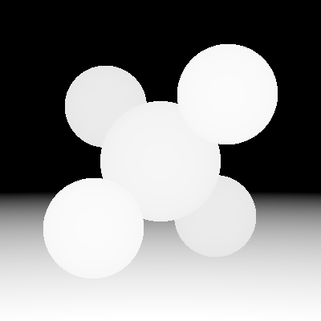

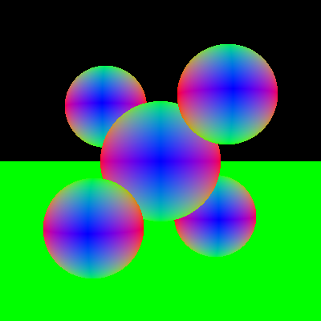

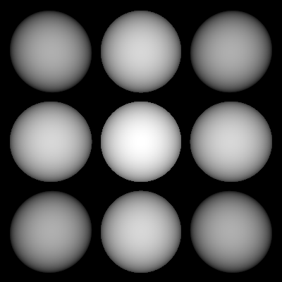

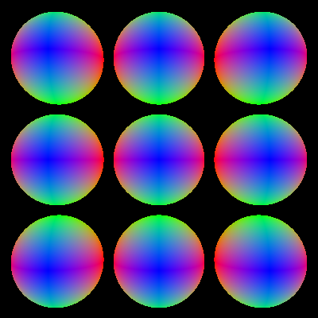

# Week 3

## Diffuse shading

### Ambient light

Implement ambient lighting in the `shade` function of `RayCaster`. It should calculate a color based on `scene.ambientLight` multiplied by the hit material's diffuse color.

### Render shaded image

Update your `raycastPixel` function. Whenever there is an intersection in your scene, call `image.setPixel` with the results of `shade`. When there is not an intersection, call `image.setPixel` with `scene.backgroundColor`.

### Diffuse shading

Implement the `shade` function in `Material`. It should return the shaded diffuse color for a single light source (see lecture notes).

Update the `shade` function in `RayCaster` to iterate over each `scene.lights` and call `shade` on the hit material (use `light.getIllumination`). The returned value should be the sum of each light's shaded color and the previously calculated ambient light shading.

### Hints

- Set `SCENES_TO_PARSE` to `SceneFile.spheres`
- Make sure light direction and surface normals are normalized for diffuse calculations!
- Make sure your code displays the shaded image automatically. Press `N` on your keyboard to view the normals image, `D` to view the depth image, `I` to view the shaded image.

### Expected results

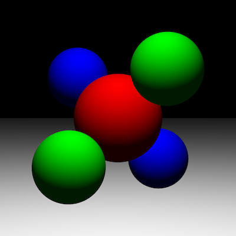

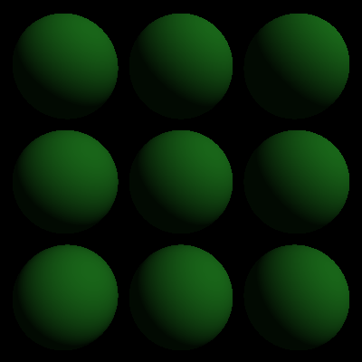

# Week 4

## Phong shading model

### Specular shading

Update the `shade` function in `Material`. It should now implement the specular component and diffuse component of the phong shading model (see lecture notes).

### Hints

- Set `SCENES_TO_PARSE` to `SceneFile.spheres`
- Make sure light direction and surface normals are normalized for specular calculations!
- Make sure your code displays the shaded image automatically. Press `N` on your keyboard to view the normals image, `D` to view the depth image, `I` to view the shaded image.

### Expected results

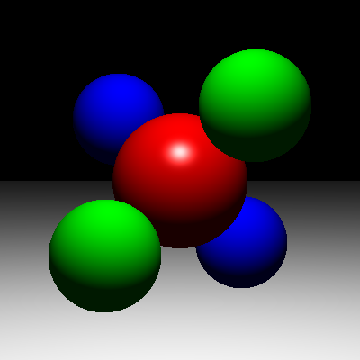

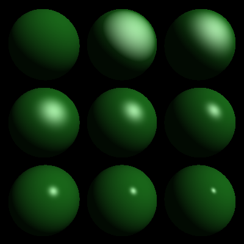

# Week 5

## Transformations

Implement the `intersect` function in `Transform`. Reference slides and `MathHelper.swift` as necessary.

### Expected results

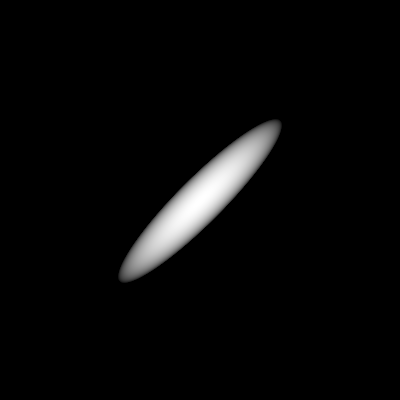

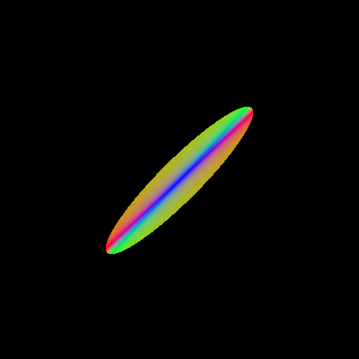

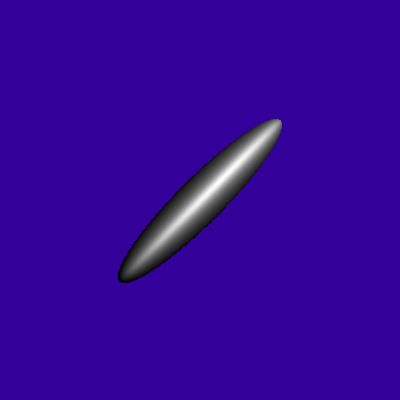

### Hints

- Set `SCENES_TO_PARSE` to `SceneFile.transforms`
- Make sure you are consistent with normalizing vs not normalizing. You may need to modify old code!

# Week 6

## Ray-triangle intersection

Implement the `intersect` function in `Triangle`. Reference slides and `MathHelper.swift` as necessary.

### Expected results

You can view the expected results [here](./Solution Images/Week 6/).

### Hints

- Set `SCENES_TO_PARSE` to `SceneFile.triangles`
- Remember to use the barycentric values for interpolating your normals!

# Resources

## Slides

The original 6.837 slides are available for free [here](http://ocw.mit.edu/courses/electrical-engineering-and-computer-science/6-837-computer-graphics-fall-2012/lecture-notes/). We're focusing on lectures 11 through 18.

My adaptations of the slides will be hosted [here](https://github.com/dionlarson/Build-a-Ray-Tracer-in-Swift-Slides) and updated from now throughout the end of the class.

# Legal stuff

Ray caster/tracer skeleton code and scene files adapted from starter code provided by MIT 6.837 on OCW. Originally taught by Wojciech Matusik and Frédo Durand in Fall 2012.

All additional code written by Dion Larson unless noted otherwise.

Original skeleton code available for free [here](http://ocw.mit.edu/courses/electrical-engineering-and-computer-science/6-837-computer-graphics-fall-2012/) (assignments 4 & 5).

Licensed under [Creative Commons 4.0 (Attribution, Noncommercial, Share Alike)](http://creativecommons.org/licenses/by-nc-sa/4.0/).
